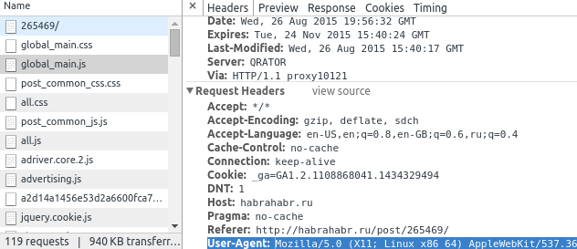

name: inverse
layout: true
class: center, middle, inverse

---
#Web-parsing/scraping/stripping
---
##Web-parsing/scraping/stripping
#...or that thing that you do when there is no API.
---
.right-section[
### Intro
]

# Yuriy Ackermann
## [keybase.io/niemand](https://keybase.io/niemand) 
## [github.com/herrniemand](https://github.com/herrniemand) 

---

# Reasons
---
.right-section[
### Reasons
]
# No API
## Most of the websites simply do not provide API.
---
.right-section[
### Reasons
]
# API Limitations
## Low request quota, high prices, bad API.
---
.right-section[
### Reasons
]
# Research wise
## Practice your skills, play with technologies, test how much of a dick can we be to a website.
---
.right-section[
### Reasons
]
## Why not?
# Why not!
---
# Tutorial plan
---
.right-section[
### Tutorial plan
]
# 1. Connect
## URLLIB
---
.right-section[
### Tutorial plan
]
## 1. Connect
### URLLIB

# 2. Parse
## BeautifulSoup4
---
.right-section[
### Tutorial plan
]
## 1. Connect
### URLLIB (20 min)

## 2. Parse
### BeautifulSoup4 (40 min)

# 3. Parallelize
## Server/Client parser implementation (60m - 75min)
---
.right-section[
### Tutorial plan
]
## 1. Connect
### URLLIB (20 min)

## 2. Parse
### BeautifulSoup4 (40 min)

## 3. Parallelize
### Server/Client parser implementation (60m - 75min)

# 4. Q/A and Bonus

---
# \#1 Connect
---
.right-section[
### \#1 Connect
]
## To connect we will use `urllib`. A standard python url handling library.

## In python 3 it was moved to two separate modules `urllib.request` and `urllib.parse`

---
class: left, center

.right-section[
### \#1 Connect
]

# Example
## Lets try to load `google.com`

```python
import urllib.request as request

data = request.urlopen('https://google.com/')

print(data.read().decode('utf-8'))
```

---
class: left, center

.right-section[
### \#1 Connect
]

# You should get something like this:
```shell
$ python3 practice.py 
<!doctype html><html itemscope="" itemtype="http://schema.org/WebPage" 
lang="en-NZ"><head><meta content="/images/google_favicon_128.png" 
itemprop="image"><title>Google</title...
```

---
.right-section[
### \#1 Connect
]

# UTF-8 EVERYTHING YOU MUST

## `str.encode('utf-8')`
## `str.decode('utf-8')`

---
class: left, center

.right-section[
### \#1 Connect
]

# You should get something like this:
```shell
$ python3 practice.py 
<!doctype html><html itemscope="" itemtype="http://schema.org/WebPage" 
lang="en-NZ"><head><meta content="/images/google_favicon_128.png" 
itemprop="image"><title>Google</title...
```

# That is webpage source!

---
.right-section[
### \#1 Connect
]

# POST requests

---
.right-section[
### \#1 Connect
]

## Go to [`http://postcatcher.in/`](http://postcatcher.in/) and get your self a link

---
class: left, center

.right-section[
### \#1 Connect
]

### POST request

## Code:

```python
import urllib.request as request
import urllib.parse as parse

url = 'http://postcatcher.in/catchers/TheUniqueID'

# POST request body
body = {
    'username': 'example',
    'password' : 'examplePassword'
}

# Encode POST request body
data = parse.urlencode(body)
data = data.encode('utf-8')

req = request.Request(url, data)
resp = request.urlopen(req)

print(resp.read().decode('utf-8'))
```
---
class: left, center

.right-section[
### \#1 Connect
]

### POST request

## Code:
```shell
$ python3 practice.py 
Created
```

---
class: left, center

.right-section[
### \#1 Connect
]

### POST request

## Code:
```shell
$ python3 practice.py 
Created
```

# We should get something like this:


---
.right-section[
### \#1 Connect
]
# GET requests

---
class: left, center

.right-section[
### \#1 Connect
]

### GET request

## Lets load Korean version of google by adding GET 
## Code:

```python
import urllib.request as request
import urllib.parse as parse

url = 'https://www.google.co.nz/'

body = {
    'hl': 'ko' # Change language to Korean
}

# Encode GET request body
data = parse.urlencode(body)

req = request.Request(url + '?' + data)
resp = request.urlopen(req)

print(resp.read().decode('utf-8'))
```

---

.right-section[
### \#1 Connect
]

# POST vs GET

---
.right-section[
### \#1 Connect
]

## POST vs GET
# GET - Requests data from a specified resource

---
.right-section[
### \#1 Connect
]

## POST vs GET
# GET - Requests data from a specified resource
# POST - Submits data to be processed to a specified resource

---
class: left, center
.right-section[
### \#1 Connect
]

# If we want to get google search result, we can simply do GET request of the search page
```python
import urllib.request as request
import urllib.parse as parse

url = 'https://google.com/search'

body = {
    'q': 'Monthy Python'
}

# Encode POST request body
data = parse.urlencode(body)

req = request.Request(url + '?' + data)
resp = request.urlopen(req)

print(resp.read().decode('utf-8'))
```

---
class: left, center
.right-section[
### \#1 Connect
]

```shell
$ python practice.py...
```

---
class: left, center
.right-section[
### \#1 Connect
]

```shell
$ python3 practice.py 
Traceback (most recent call last):
  File "practice.py", line 3, in <module>
    data = request.urlopen('https://google.com/search?q=test')
  File "/usr/lib/python3.4/urllib/request.py", line 153, in urlopen
    return opener.open(url, data, timeout)
  File "/usr/lib/python3.4/urllib/request.py", line 461, in open
    response = meth(req, response)
  File "/usr/lib/python3.4/urllib/request.py", line 571, in http_response
    'http', request, response, code, msg, hdrs)
  File "/usr/lib/python3.4/urllib/request.py", line 493, in error
    result = self._call_chain(*args)
  File "/usr/lib/python3.4/urllib/request.py", line 433, in _call_chain
    result = func(*args)
  File "/usr/lib/python3.4/urllib/request.py", line 676, in http_error_302
    return self.parent.open(new, timeout=req.timeout)
  File "/usr/lib/python3.4/urllib/request.py", line 461, in open
    response = meth(req, response)
  File "/usr/lib/python3.4/urllib/request.py", line 571, in http_response
    'http', request, response, code, msg, hdrs)
  File "/usr/lib/python3.4/urllib/request.py", line 499, in error
    return self._call_chain(*args)
  File "/usr/lib/python3.4/urllib/request.py", line 433, in _call_chain
    result = func(*args)
  File "/usr/lib/python3.4/urllib/request.py", line 579, in http_error_default
    raise HTTPError(req.full_url, code, msg, hdrs, fp)
urllib.error.HTTPError: HTTP Error 403: Forbidden
```

# WAT???

---

.right-section[
### \#1 Connect
]

# Sites like google have an API.
# They want us to use it. 
# They don't want us to do the web-parsing!

---

.right-section[
### \#1 Connect
]

# But how do they know that you are a ROBOT?


---
.right-section[
### \#1 Connect
]

# Headers

---

.right-section[
### Definition
]

# HTTP message HEADERS are used to precisely describe the resource being fetched or the behavior of the server or the client. 
### [https://developer.mozilla.org/en-US/docs/Web/HTTP/Headers](https://developer.mozilla.org/en-US/docs/Web/HTTP/Headers)

---
.right-section[
### \#1 Connect
]

# Good example of a HEADER is 
# `User-Agent`

---
.right-section[
### \#1 Connect
]

# My chromium header:
`Mozilla/5.0 (X11; Linux x86_64) AppleWebKit/537.36 (KHTML, like Gecko) Ubuntu Chromium/44.0.2403.89 Chrome/44.0.2403.89 Safari/537.36`

---
.right-section[
### \#1 Connect
]

# Every browser sends `User-Agent` header to the server.

---

.right-section[
### \#1 Connect
]

# But not our script

---
.right-section[
### \#1 Connect
]

# And thats how google knows that you are a BOT.

---
.right-section[
### \#1 Connect
]

# So lets fool google by setting our self a `User-Agent` HEADER

---
class: left
.right-section[
### \#1 Connect
]

# In the browser open dev-tools:

## * Right-click -> Inspect Element

## * Got to Network tab

## * Select any of the requests and find in the request properties `User-Agent`

---
class: left
.right-section[
### \#1 Connect
]




---
class: left
.right-section[
### \#1 Connect
]

## Copy your `User-Agent`

```python
import urllib.request as request
import urllib.parse as parse

url = 'https://google.com/search'

headers = {
  'User-Agent' : 'Mozilla/5.0 (X11; Linux x86_64) AppleWebKit/537.36 (KHTML, like Gecko) Ubuntu Chromium/44.0.2403.89 Chrome/44.0.2403.89 Safari/537.36'
}

body = {
    'q': 'Monthy Python'
}

# Encode POST request body
data = parse.urlencode(body)

req = request.Request(url + '?' + data, headers=headers)
resp = request.urlopen(req)

print(resp.read().decode('utf-8'))
```

---
class: left
.right-section[
### \#1 Connect
]

# Now we should get

```shell
$ python3 practice.py
<!doctype html><html itemscope="" itemtype="http://schema.org/SearchResultsPage" lang="en-NZ">
<head><meta content="/images/google_favicon_128.png" itemprop="image">
<meta content="origin" id="mref" name="referrer"><title>Monthy Python - Google Search</title>
```

---

# Stripping

---

# I mean Parsing...

---

# ...or Scraping

---

.right-section[
### \#2 Stripping
]

# Understanding HTML and CSS

---

.right-section[
### Definitions
]

# HTML
## HyperText Markup Language, is the standard markup language used to create web pages.

---

.right-section[
### Definitions
]

# CSS
## Cascading Style Sheets, is a style sheet language used for describing the look and formatting of a document written in a markup language

---
class: left

.right-section[
### \#2 Stripping
]

# HTML Example

```html
<!DOCTYPE html>
<html>
    <head>
        <title>Example</title>
    </head>
    <body>
        <section id="content">
            <article class="tooltip head"></article>
            <article class="left head" data-type="special"></article>
            <article class="right head"></article>
        </section>
    </body>
</html>
```

---
class: left

.right-section[
### \#2 Stripping
]

# HTML Element/Tag

```html
...
        <title>Example</title> 
...
```

---
class: left

.right-section[
### \#2 Stripping
]

# HTML id
## In HTML/CSS id is unique.

```html
...
        <section id="content">
            ...
        </section>
...
```

---
class: left

.right-section[
### \#2 Stripping
]

# HTML Classes
## In HTML/CSS class is not unique, and there could be more then one class per element.

```html
...
            <article class="tooltip head"></article>
            <article class="left head" data-type="special"></article>
            <article class="right head"></article>
...
```

---
class: left

.right-section[
### \#2 Stripping
]

# HTML Attributes
## Class, id are SPECIAL attributes. When we are generally talking about attributes in web development, we generally mean "Any attribute but class or id". If we talk about class/id, we mean value of class/id attribute.
```html
...
            <article class="left head" data-type="special"></article>
...
```

---
class: left

.right-section[
### \#2 Stripping
]

# CSS Selectors
# `tag`
# `#id`
# `.class`

---
class: left
.right-section[
### \#2 Stripping
]

#HTML DOM


---
class: left
.right-section[
### \#2 Stripping
]

# BeautifulSoup4

## You didn't write that awful page. You're just trying to get some data out of it. Beautiful Soup is here to help. Since 2004, it's been saving programmers hours or days of work on quick-turnaround screen scraping projects.

## `pip3 install beautifulsoup4`

---

class: left
.right-section[
### \#2 Stripping
]

# Back to our code:

```python
import urllib.request as request
import urllib.parse as parse

url = 'https://google.com/search'

headers = {
  'User-Agent' : 'Mozilla/5.0 (X11; Linux x86_64) AppleWebKit/537.36 (KHTML, like Gecko) Ubuntu Chromium/44.0.2403.89 Chrome/44.0.2403.89 Safari/537.36'
}

body = {
    'q': 'Monthy Python'
}

# Encode POST request body
data = parse.urlencode(body)

req = request.Request(url + '?' + data, headers=headers)
resp = request.urlopen(req)

print(resp.read().decode('utf-8'))
```

---

class: left
.right-section[
### \#2 Stripping
]

## Lets create function `prepare` and import `BeautifulSoup`...

```python
from bs4 import BeautifulSoup

...

def prepare( data ):
    soup = BeautifulSoup(data, 'html.parser')
    title = soup.find('title').text
    return title
```

---
class: left
.right-section[
### \#2 Stripping
]

## ...and parse google.com title
```python
...
htmlContent = resp.read().decode('utf-8')
print(prepare(htmlContent))
...
```

## We should get something like this:
```shell
$ python3 practice.py
Google
```

---

.right-section[
### \#2 Stripping
]

# The End.

---
.right-section[
### \#2 Stripping
]

# Joking

---
.right-section[
### \#2 Stripping
]

# Parsing Steam

---
.right-section[
### \#2 Stripping
]

# Why Steam? Steam has an API?

---
.right-section[
### \#2 Stripping
]

# Because I already done it, and because it has enough *unforeseen pitfalls*.

---
.right-section[
### \#2 Stripping
]

# Lets look for example at HL2 on Steam
## [http://store.steampowered.com/app/220](http://store.steampowered.com/app/220)

## P.S. Where is HL3 Gaben!!!

### 
---
.right-section[
### \#2 Stripping
]


---
class: left
.right-section[
### \#2 Stripping
]
.center[
# We have
]
## Name 
## Price(amount and currency) 
## Rating(total and median) 
## Tags
## AppID(220)

---
.right-section[
### \#2 Stripping
]

# Why are we not doing *genre*, *publisher* and *release date*?

---
.right-section[
### \#2 Stripping
]

# Because the way block done, we need a lot of regex in which I, sadly, suck.
# We going for basics today. 

---
class: left
.right-section[
### \#2 Stripping
]
## Object model
```python
game = {
    'appid'    : 0,
    'name'     : '',
    'price'    : 0.0,
    'currency' : '',
    'tags'     : [],
    'rating'   : {
        'total': 0,
        'count': 0
    }
}
```
---
class: left
.right-section[
### \#2 Stripping
]

## Add model to our soup, and comment title for now
```python
def prepare( data ):
    soup  = BeautifulSoup(data, 'html.parser')
    # title = soup.find('title').text
    game = {
        'appid'    : 0,
        'name'     : '',
        'price'    : 0.0,
        'currency' : '',
        'tags'     : [],
        'rating'   : {
            'total': 0,
            'count': 0
        }
    }
    return game
```

---
.right-section[
### \#2 Stripping
]

# BS - BeautifulSoup, not BullShit
---
.right-section[
### \#2 Stripping
]
# BS4

## `.find()` - Return only the first child of this Tag matching the given criteria.
## `.find_all()` -  Extracts a list of Tag objects that match the given criteria.

---
.right-section[
### \#2 Stripping
]
# Name

## Lets go back to [http://store.steampowered.com/app/220](http://store.steampowered.com/app/220)

---
.right-section[
### \#2 Stripping
]

## Right-click the name -> Inspect element


---
.right-section[
### \#2 Stripping
]

## Right-click the name -> Inspect element


## As we can see, the name is in tag `div` and its class `apphub_AppName`

---
class: left
.right-section[
### \#2 Stripping
]

```python
def prepare( data ):
    soup  = BeautifulSoup(data, 'html.parser')
    # title = soup.find('title').text
    game = {
        'appid'    : 0,
        'name'     : soup.find('div', {'class': 'apphub_AppName'}),
        'price'    : 0.0,
        'currency' : '',
        'tags'     : [],
        'rating'   : {
            'total': 0,
            'count': 0
        }
    }
    return game
```

---
class: left
.right-section[
### \#2 Stripping
]
## If we will try now to run our parser

```shell
$ python3 practice.py
{'rating': {'total': 0, 'count': 0}, 'name': <div class="apphub_AppName">Half-Life 2</div>, 'tags': [], 'appid': 0, 'price': 0.0, 'currency': ''}
```

---
class: left
.right-section[
### \#2 Stripping
]
## If we will try now to run our parser

```shell
$ python3 practice.py
{'rating': {'total': 0, 'count': 0}, 'name': <div class="apphub_AppName">Half-Life 2</div>, 'tags': [], 'appid': 0, 'price': 0.0, 'currency': ''}
```

## We got name tag

## It doesn't matter that it is a tag object. Right now we are simply getting elements.

---
class: left
.right-section[
### \#2 Stripping
]
## Lets continue do it for everything else
```python
def prepare( data ):
    soup  = BeautifulSoup(data, 'html.parser')
    # title = soup.find('title').text
    game = {
        'appid'    : 0,
        'name'     : soup.find('div', {'class': 'apphub_AppName'}),
        'price'    : soup.find('div', {'class': 'game_purchase_price price'}),
        'currency' : soup.find('div', {'class': 'game_purchase_price price'}),
        'tags'     : [],
        'rating'   : {
            'count' : soup.find('meta', { 'itemprop' : 'ratingValue' }),
            'total' : soup.find('meta', { 'itemprop' : 'reviewCount' })
        }
    }
    return game
```

---
class: left
.right-section[
### \#2 Stripping
]

## There more then one tag, so we want to find them all with `.find_all()`

---
class: left
.right-section[
### \#2 Stripping
]

## Example of a steam tag:
```html
<a href="..." class="app_tag" style="">Sci-fi</a>
```

---
class: left
.right-section[
### \#2 Stripping
]

```python
...
'tags'     : soup.find_all('a', {'class': 'app_tag'})
...
```
---
class: left
.right-section[
### \#2 Stripping
]

## Final code
```python
def prepare( data ):
    soup  = BeautifulSoup(data, 'html.parser')
    # title = soup.find('title').text
    game = {
        'appid'    : 0,
        'name'     : soup.find('div', {'class': 'apphub_AppName'}),
        'price'    : soup.find('div', {'class': 'game_purchase_price price'}),
        'currency' : soup.find('div', {'class': 'game_purchase_price price'}),
        'tags'     : soup.find_all('a', {'class': 'app_tag'}),
        'rating'   : {
            'count' : soup.find('meta', { 'itemprop' : 'ratingValue' }),
            'total' : soup.find('meta', { 'itemprop' : 'reviewCount' })
        }
    }
    return game
```

---
class: left
.right-section[
### \#2 Stripping
]

## Result
```shell
$ python3 practice.py
{'tags': [<a... TOO MUCH CONTENT TO PUT IN A SLIDE
```


---
.right-section[
### \#2 Stripping
]
## Thats cool, we made function that finds and returns HTML elements, now we need data out of that.

---
.right-section[
### \#2 Stripping
]
## Thats cool, we made function that finds and returns HTML elements, now we need data out of that.

# Lets make a `cook()` function for that!
---
class: left
.right-section[
### \#2 Stripping
]

```python
def cook(content):
    pass
```

---
class: left
.right-section[
### \#2 Stripping
]

## Our cook function will use the same game model as prepare, so lets just copy it over, and access to old data corresponding elements

```python
def cook( data ):
    game = {
        'appid'     : data['appid'],
        'name'      : data['name'],
        'price'     : data['price'],
        'currency'  : data['currency'],
        'tags'      : data['tags'],
        'rating'    : {
            'total' : data['rating']['total'],
            'count' : data['rating']['count']
        }
    }
    return game

```
---
class: left
.right-section[
### \#2 Stripping
]

## From *Name*, *Price*, *Curerncy* we need just inner content. We can get that by accessing `.text` attribute

```python
...
        'name'      : data['name'].text,
        'price'     : data['price'].text,
        'currency'  : data['currency'].text,
...
```

---
class: left
.right-section[
### \#2 Stripping
]

## *Tags* are a list of HTML tags. We can get their inner by iterating through the list and accessing each tags with `.text` attribute.

```python
...
        'tags'      : [ tag.text for tag in data['tags'] ],
...
```

---
class: left
.right-section[
### \#2 Stripping
]

## If we look at rating *meta* tags

```html
...
            <meta itemprop="reviewCount" content="26072">
            <meta itemprop="ratingValue" content="10">
...
```

## We can access `content` attribute of meta tags as dictionary:
```python
        'rating'    : {
            'total' : data['rating']['total']['content'],
            'count' : data['rating']['count']['content']
        }
```
---
class: left
.right-section[
### \#2 Stripping
]

## We should end up with something like this
```python
def cook( data ):
    game = {
        'appid'     : data['appid'],
         'name'     : data['name'].text,
        'price'     : data['price'].text,
        'currency'  : data['currency'].text,
        'tags'      : [ tag.text for tag in data['tags'] ],
        'rating'    : {
            'total' : data['rating']['total']['content'],
            'count' : data['rating']['count']['content']
        }
    }
    return game
```

---
class: left
.right-section[
### \#2 Stripping
]

## Lets test it out:

```python
print(cook(prepare(htmlContent)))
```


```shell
$ python3 practice.py
{'rating': {'count': '10', 'total': '26072'}, 'currency': 
'\r\n\t\t\t\t\t\t\tNZ$ 11.99\t\t\t\t\t\t', 
'price': '\r\n\t\t\t\t\t\t\tNZ$ 11.99\t\t\t\t\t\t', 'appid': 0, 'tags': ['\r\n\t\t\t\t\t\t\t\t\t\t\t\tFPS\t\t\t\t\t\t\t\t\t\t\t\t',
'\r\n\t\t\t\t\t\t\t\t\t\t\t\tAction\t\t\t\t\t\t\t\t\t\t\t\t',
'\r\n\t\t\t\t\t\t\t\t\t\t\t\tSci-fi\t\t\t\t\t\t\t\t\t\t\t\t',
'\r\n\t\t\t\t\t\t\t\t\t\t\t\tClassic\t\t\t\t\t\t\t\t\t\t\t\t',
'\r\n\t\t\t\t\t\t\t\t\t\t\t\tSingleplayer\t\t\t\t\t\t\t\t\t\t\t\t', '\r\n\t\t\t\t\t\t\t\t\t\t\t\tStory Rich\t\t\t\t\t\t\t\t\t\t\t\t',
```

---
class: left
.right-section[
### \#2 Stripping
]

## So we finished right?
## I mean we can just simply stick **for loop** and bruteforce entire steam?

---
class: left
.right-section[
### \#2 Stripping
]

## Lets change url to [http://store.steampowered.com/app/7340](http://store.steampowered.com/app/7340)

```python
url = 'http://store.steampowered.com/app/7340'
```

---
class: left
.right-section[
### \#2 Stripping
]

## Lets change url to [http://store.steampowered.com/app/7340](http://store.steampowered.com/app/7340)

```python
url = 'http://store.steampowered.com/app/7340'
```

```shell
$ python3 practice.py
...
```
---
class: left
.right-section[
### \#2 Stripping
]

## Lets change url to [http://store.steampowered.com/app/7340](http://store.steampowered.com/app/7340)

```python
url = 'http://store.steampowered.com/app/7340'
```

```shell
$ python3 practice.py
Traceback (most recent call last):
  File "practice.py", line 53, in <module>
    print(cook(prepare(htmlContent)))
  File "practice.py", line 36, in cook
    'price'     : data['price'].text,
AttributeError: 'NoneType' object has no attribute 'text'

```
# Shit...
---
.right-section[
### \#2 Stripping
]

# Unforeseen Pitfalls 

---
.right-section[
### \#2 Stripping
]

## We currently tested our code on the *perfect* example.

---
.right-section[
### \#2 Stripping
]

## We currently tested our code on the *perfect* example.

## It has Name, Price, Tags etc.

---
.right-section[
### \#2 Stripping
]

## We currently tested our code on the *perfect* example.

## It has Name, Price, Tags etc.

## But not all games pages are *perfect*

---
.right-section[
### \#2 Stripping
]

# Price


.left[
[http://store.steampowered.com/app/220](http://store.steampowered.com/app/220)
]

# Free to play


.left[
[http://store.steampowered.com/app/440](http://store.steampowered.com/app/440)
]

# No price at all


.left[
[http://store.steampowered.com/app/7340](http://store.steampowered.com/app/7340)
]

---
.right-section[
### \#2 Stripping
]

# Region locked games


---
.right-section[
### \#2 Stripping
]
# 404 redirection to main page
## [http://store.steampowered.com/app/230](http://store.steampowered.com/app/230)
---
.right-section[
### \#2 Stripping
]

## So writing parsing, is simply a process of proving *Murphys Law*.
## If anything can go wrong, it, bloody, will!

---
.right-section[
### \#2 Stripping
]

# Possible faults

---
class: left
.right-section[
### \#2 Stripping
]

## GET request. Timeout, DNS, Host Is Down, No Internet 
---
class: left
.right-section[
### \#2 Stripping
]

## GET request. Timeout, DNS, Host Is Down, No Internet 
## Page does not have price, tags, name etc.
---
class: left
.right-section[
### \#2 Stripping
]

## GET request. Timeout, DNS, Host Is Down, No Internet 
## Page does not have price, tags, name etc.
## Error page -> Region locked games
---
class: left
.right-section[
### \#2 Stripping
]

## GET request. Timeout, DNS, Host Is Down, No Internet 
## Page does not have price, tags, name etc.
## Error page -> Region locked games
## 404 Error. Redirection to main page

---
class: left
.right-section[
### \#2 Stripping
]

## GET request. Timeout, DNS, Host Is Down, No Internet 
## Page does not have price, tags, name etc.
## Error page -> Region locked games
## 404 Error. Redirection to main page
## Cosmic radiation in a form of HEP(High Energetic Particles), e.g. Muons.

---
class: left
.right-section[
### \#2 Stripping
]

## GET request. Timeout, DNS, Host Is Down, No Internet 
## Page does not have price, tags, name etc.
## Error page -> Region locked games
## 404 Error. Redirection to main page
## Cosmic radiation in a form of HEP(High Energetic Particles), e.g. Muons.
## Quantum fluctuations, and Casimir effect on electron movement in the processor.

---
class: left
.right-section[
### \#2 Stripping
]

## GET request. Timeout, DNS, Host Is Down, No Internet 
## Page does not have price, tags, name etc.
## Error page -> Region locked games
## 404 Error. Redirection to main page
## Cosmic radiation in a form of HEP(High Energetic Particles), e.g. Muons.
## Quantum fluctuations, and Casimir effect on electron movement in the processor.
## Other

---
class: left
.right-section[
### \#2 Stripping
]

## Lets move GET request to a separate function and wrap it with *try/except*
## As addition we add timeout of *2 seconds*

```python
def get(url):
    try:
        headers = {
          'User-Agent' : 'Mozilla/5.0 (X11; Linux x86_64) AppleWebKit/537.36 (KHTML, like Gecko) Ubuntu Chromium/44.0.2403.89 Chrome/44.0.2403.89 Safari/537.36'
        }

        req = request.Request(url, headers=headers)
        resp = request.urlopen(req, timeout=2)

        return { 'ok': True, 'data': resp.read().decode('utf-8')}
    except Exception as e:
        return { 'ok': False, 'error': str(e)}
```


---
class: left
.right-section[
### \#2 Stripping
]


---
class: left
.right-section[
### \#2 Stripping
]

# Lets test it on *perfect example*

```python
response = get('http://store.steampowered.com/app/220')
if response['ok']:
    print(cook(prepare(response['data'])))
```

```shell
$ python3 practice.py
{'tags': ['\r\n\t\t\t\t\t\t\t\t\t\t\t\tFPS\t\t\t\t\t\t\t\t\t\t\t\t'...
```

---
class: left
.right-section[
### \#2 Stripping
]

## ~~GET request. Timeout, DNS, Host Is Down, No Internet~~
## Page does not have price, tags, name etc.
## Error page -> Region locked games
## 404 Error. Redirection to main page

---
class: left
.right-section[
### \#2 Stripping
]
.center[
## Currently we have two problems with our content.
]
---
class: left
.right-section[
### \#2 Stripping
]
.center[
### Currently we have two problems with our content.
]
## Its not fail-safe. That means that if something is missing and we try to get its content, we get exception.

---
class: left
.right-section[
### \#2 Stripping
]
.center[
### Currently we have two problems with our content.
]
## Its not fail-safe. That means that if something is missing and we try to get its content, we get exception. 

## It is full of rubbish like *tabs* and *spaces*

---
class: left
.right-section[
### \#2 Stripping
]

## Lets create format function for name, price, currency, tags entries in `cook()`
```python
def cook( data ):
    def name(item):
        pass
    def price(item):
        pass
    def currency(item):
        pass
    def tag(item):
        pass
    game = {
        'appid'     : data['appid'],
        'name'      : data['name'].text,
        'price'     : data['price'].text,
        'currency'  : data['currency'].text,
        'tags'      : [ tag.text for tag in data['tags'] ],
        'rating'    : {
            'total' : data['rating']['total']['content'],
            'count' : data['rating']['count']['content']
        }
    }
    return game
```

---
class: left
.right-section[
### \#2 Stripping
]

## We need to make sure that entries are not `None` before accessing them
```python
...
    def name( item ):
        if item != None:
            return item.text
        else:
            return ''
```

---
class: left
.right-section[
### \#2 Stripping
]

## Price and currency can be *Free to play* as well, so we need to account that as well

```python
    def price( item ):
        if item != None:
            if 'Free to play' in item.text:
                return 0.0
            else:
                return item.text
        else:
            return 0.0

    def currency( item ):
        if item != None:
            if 'Free to play' in item.text:
                return ''
            else:
                return item.text
        else:
            return ''
```

---
class: left
.right-section[
### \#2 Stripping
]

## Same for ratings
```python
...
    def rating( item ):
        if item != None:
            return item['content']
        else:
            return 0
...
```

---
class: left
.right-section[
### \#2 Stripping
]

## Lets parse the values through the handling functions

```python
...
    game = {
        'appid'     : data['appid'],
        'name'      : name(data['name']),
        'price'     : price(data['price']),
        'currency'  : currency(data['currency']),
        'tags'      : [ tag.text for tag in data['tags'] ],
        'rating'    : {
            'total' : rating(data['rating']['total']),
            'count' : rating(data['rating']['count'])
        }
    }
```

---
class: left
.right-section[
### \#2 Stripping
]
## Not lets test it with *Bad* game
```python
response = get('http://store.steampowered.com/app/7340')
```

```shell
$ python3 practice.py
{'tags': ['\r\n\t\t\t\t\t\t\t\t\t\t\t\tPuzzle\t\t\t\t\t\t\t\t\t\t\t\t'], 'appid': 0, 'currency': '', 'rating': {'total': '4', 'count': '7'}, 'price': 0.0, 'name': 'Azada'}
```

---
class: left
.right-section[
### \#2 Stripping
]
.center[
### Currently we have two problems with our content.
]
## ~~Its not fail-safe. That means that if something is missing and we try to get its content, we get exception.~~

## It is full of rubbish like *tabs* and *spaces*

---
class: left
.right-section[
### \#2 Stripping
]

## For cleaning tabs, spaces and non-numeric characters we will create `clean()` function that will do regex substitution

```python
import re

...

def clean( content, form ):
    expressions = {
        'tabs' : r'[\n|\t|\r]',
        'numbers' : r'[^0-9\.]'
    }
    regex = re.compile(expressions[form])
    return regex.sub('', content)
```

---
class: left
.right-section[
### \#2 Stripping
]

## Cleaning name and price outputs
```python
...
    def name( item ):
        if item != None:
            return clean(item.text, 'tabs')
        else:
            return ''

    def price( item ):
        if item != None:
            if 'Free to play' in item.text:
                return 0.0
            else:
                return clean(item.text, 'numbers')
        else:
            return 0.0
...
        'tags'      : [ clean(tag.text, 'tabs') for tag in data['tags'] ],
...
```

---
class: left
.right-section[
### \#2 Stripping
]

## The currency is a quiet a problem. 
## It can be just symbol `£`, or text with symbol `NZ$`, and because of *Magic* python regex, we can not do unicode ranges, so we simply have to do an array of currency symbols in a regex.

```python
    def currency( item ):
        if item != None:
            if 'Free to play' in item.text:
                return ''
            else:
                return re.findall(r'[A-Za-z]*[$¢£¤¥֏؋৲৳৻૱௹฿៛€]', item.text)
        else:
            return ''

```
---
class: left
.right-section[
### \#2 Stripping
]

## Final code
```python
    def name( item ):
        if item != None:
            return clean(item.text, 'tabs')
        else:
            return ''

    def price( item ):
        if item != None:
            if 'Free to play' in item.text:
                return 0.0
            else:
                return clean(item.text, 'numbers')
        else:
            return 0.0

    def currency( item ):
        if item != None:
            if 'Free to play' in item.text:
                return ''
            else:
                return re.findall(r'[A-Za-z]*[$¢£¤¥֏؋৲৳৻૱௹฿៛€]', item.text)
        else:
            return ''

    def rating( item ):
        if item != None:
            return item['content']
        else:
            return 0
```
---
class: left
.right-section[
### \#2 Stripping
]

## Lets test it out

```shell
$ python3 practice.py 
{'currency': ['NZ$'], 'appid': 0, 'price': '11.99', 'name': 'Half-Life 2', 
'rating': {'total': '26081', 'count': '10'}, 'tags': ['FPS', 'Action', 'Sci-fi'
, 'Classic', 'Singleplayer', 'Story Rich', 'Shooter', 'Adventure', 
'First-Person', 'Dystopian ', 'Atmospheric', 'Great Soundtrack', 'Zombies', 
'Aliens', 'Silent Protagonist', 'Physics', 'Moddable', 'Horror', 'Puzzle', 
'Multiplayer']}
```

---
class: left
.right-section[
### \#2 Stripping
]

## ~~GET request. Timeout, DNS, Host Is Down, No Internet~~
## ~~Page does not have price, tags, name etc.~~
## Error page -> Region locked games
## 404 Error. Redirection to main page

---

class: left
.right-section[
### \#2 Stripping
]

## Do you still remember the `title` block in a `prepare()` function that we commented at the beginning?

```python
    # title = soup.find('title').text
```
---

class: left
.right-section[
### \#2 Stripping
]

## Do you still remember the `title` block in a `prepare()` function that we commented at the beginning?

```python
    # title = soup.find('title').text
```

## When there is region lock or any serious error, the title have `Site Error` in its title. And because we know that title is **always** there, we can simply ignore check. 

```python
    ...
    if not 'Site Error' in soup.find('title').text:
        game = {
            'appid'    : 0,
            ...
        }
```

---
class: left
.right-section[
### \#2 Stripping
]

## ~~GET request. Timeout, DNS, Host Is Down, No Internet~~
## ~~Page does not have price, tags, name etc.~~
## ~~Error page -> Region locked games~~
## 404 Error. Redirection to main page

---
class: left
.right-section[
### \#2 Stripping
]

## So when we get 404 at Steam, we get redirected to main page. 
## So we just need compare original url and returned

---
class: left
.right-section[
### \#2 Stripping
]

## To get access to response url, we simply access url attribute of response
```python
    response.url
```

## So lets return if urls are match

```python
def get(url):
    try:
        headers = {
          'User-Agent' : 'Mozilla/5.0 (X11; Linux x86_64) AppleWebKit/537.36 (KHTML, like Gecko) Ubuntu Chromium/44.0.2403.89 Chrome/44.0.2403.89 Safari/537.36'
        }

        req = request.Request(url, headers=headers)
        resp = request.urlopen(req, timeout=2)

        return { 
            'ok': True,
            'URLMatch': url == resp.url,
            'data': resp.read().decode('utf-8')
        }
    except Exception as e:
        return { 'ok': False, 'error': str(e)}
...

if response['ok'] and response['URLMatch']:
    print(cook(prepare(response['data'])))
```

---
# Your thought right now


---
# Well then


---

# ~~\#3 Paralelise~~
# ~~\#3 Parallelise~~
# \#3 Parallelize